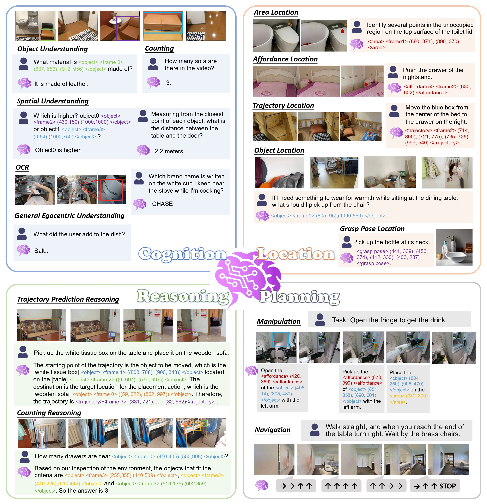
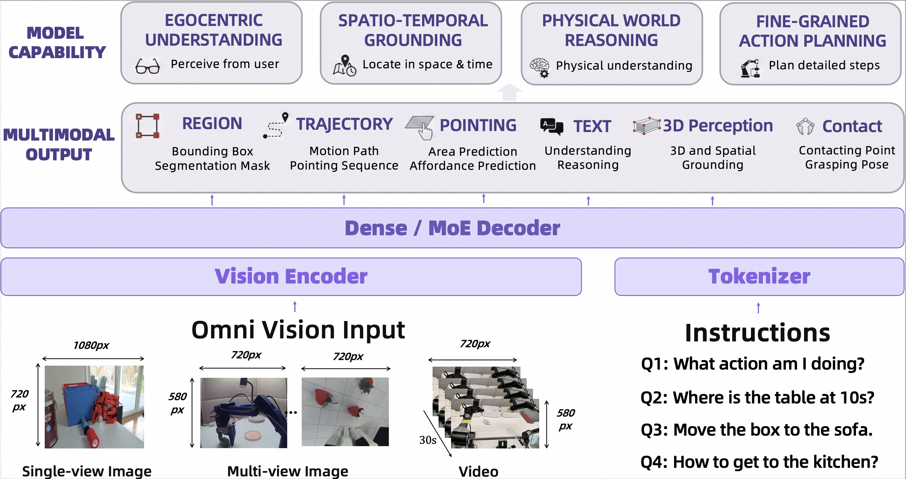
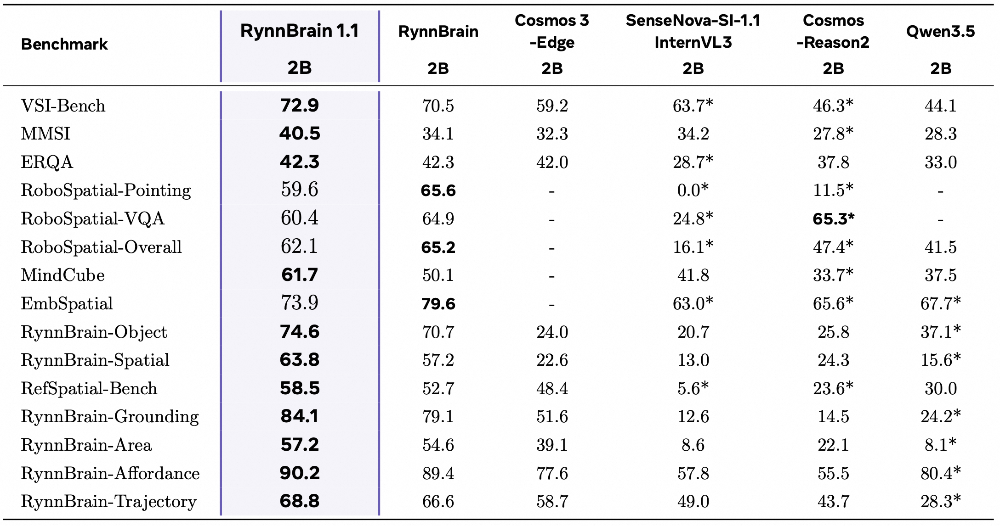
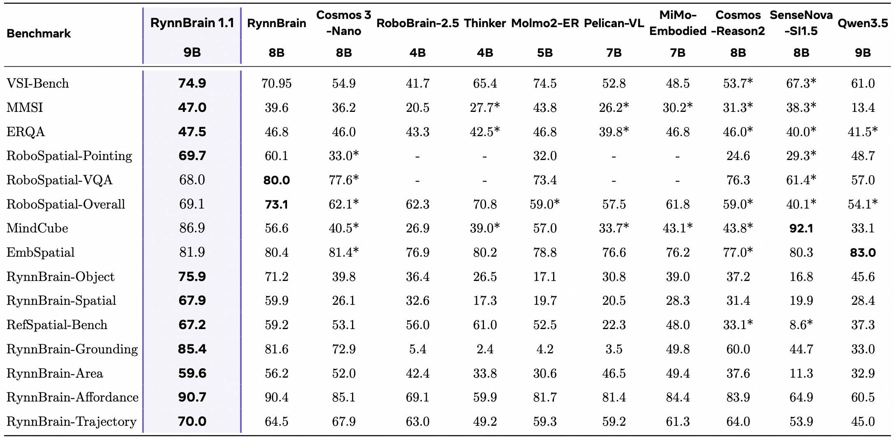
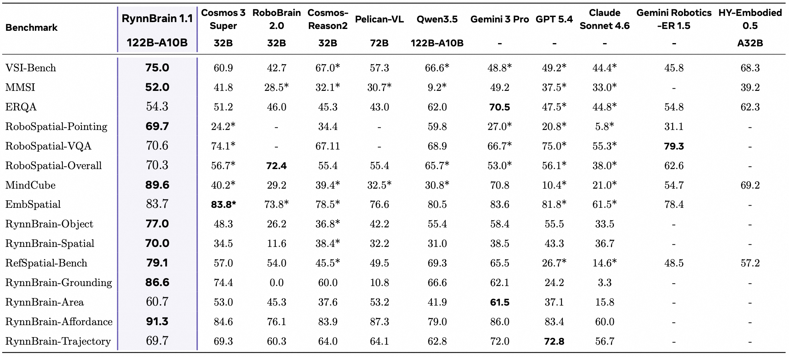
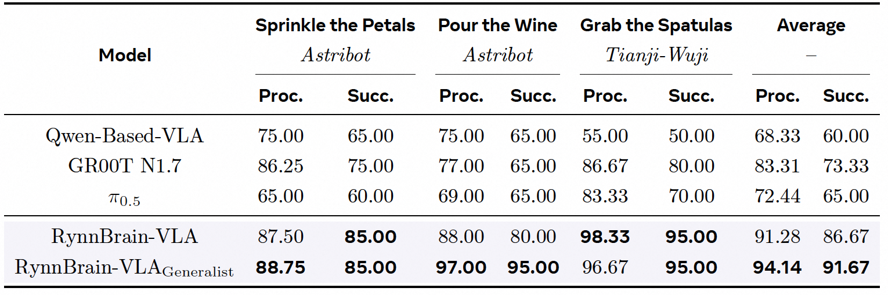
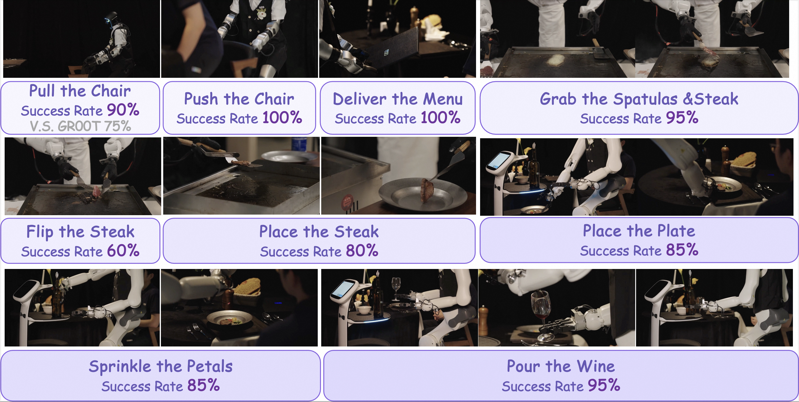
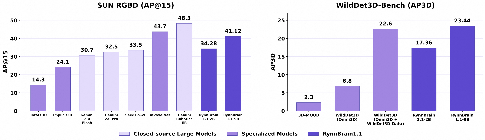
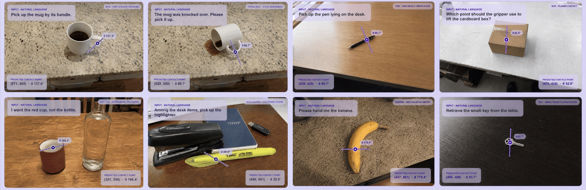
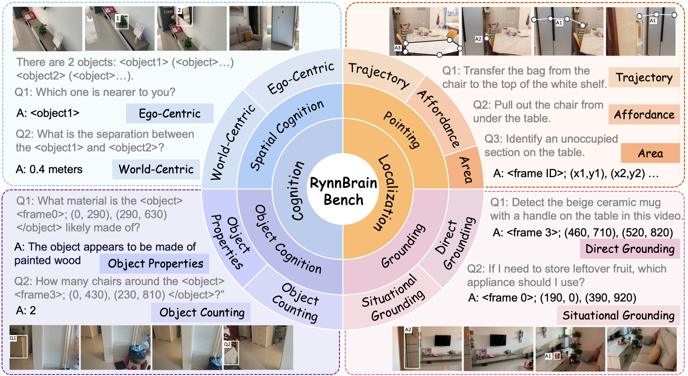

# RynnBrain 1.1
<p align="center">

</p>

<p align="center"><i>Towards More Capable and Generalizable Embodied Foundation Models</i></p>

<p align="center">
       💫 <a href="https://alibaba-damo-academy.github.io/RynnBrain/"><b>Project Page</b></a> &nbsp;&nbsp;|&nbsp;&nbsp; 🤗 <a href="https://huggingface.co/collections/Alibaba-DAMO-Academy/rynnbrain-11"><b>Hugging Face</b></a> &nbsp;&nbsp;|&nbsp;&nbsp; 🤖 <a href="https://modelscope.cn/collections/DAMO_Academy/RynnBrain-11"><b>ModelScope</b></a> &nbsp;&nbsp;|&nbsp;&nbsp; 📚 <a href="https://github.com/alibaba-damo-academy/RynnBrain/tree/main/cookbooks"><b>Cookbooks</b></a> &nbsp;&nbsp;|&nbsp;&nbsp; 📄 <a href="https://arxiv.org/abs/2602.14979"><b>arXiv</b></a>
 &nbsp;&nbsp;|&nbsp;&nbsp;  📄 <a href="https://raw.githubusercontent.com/alibaba-damo-academy/RynnBrain.github.io/main/assets1.1/RynnBrain_1_1.pdf"> <b>1.1 paper</b></a> </p> 


## News
* **[2026.07.16]**  ✨✨ Release **RynnBrain 1.1** checkpoints (**2B / 9B / 122B-A10B**) on <a href="https://huggingface.co/collections/Alibaba-DAMO-Academy/rynnbrain-11">Hugging Face</a> & <a href="https://modelscope.cn/collections/DAMO_Academy/RynnBrain-11">ModelScope</a>!
* **[2026.07.16]**  ✨✨ Release **RynnBrain 1.1** <a href="https://raw.githubusercontent.com/alibaba-damo-academy/RynnBrain.github.io/main/assets1.1/RynnBrain_1_1.pdf">Technical Report</a> !
* **[2026.07.16]**  ✨✨ Release **RynnBrain 1.1**! To access the resources of **RynnBrain 1.0**, please checkout to the <a href="https://github.com/alibaba-damo-academy/RynnBrain/tree/rynnbrain1.0">rynnbrain1.0</a> branch.
* **[2026.04.13]**  🔥🔥 Launch <a href="https://huggingface.co/Alibaba-DAMO-Academy/RynnBrain-4B">RynnBrain-4B </a> !!
* **[2026.02.17]**  🔥🔥 Release **RynnBrain 1.0** <a href="https://arxiv.org/abs/2602.14979v1">Technical Report</a> !!
* **[2026.02.09]**  🔥🔥 Release code and model checkpoints of **RynnBrain 1.0**!!


## Introduction
  We present **RynnBrain 1.1**, a systematic upgrade of RynnBrain for embodied intelligence. RynnBrain 1.1 is released in three scales: **2B**, **9B**, and **122B-A10B**, extending the model family from compact dense models to its first 122B-level sparse-MoE model.

## What's New in 1.1 🚀
* **Unified Embodied Scaling to 122B**: 
Establishes the first embodied brain model at the 122B scale under a unified training recipe shared across 2B, 9B, and 122B-A10B, enabling a systematic study of how embodied cognition, spatial reasoning, grounding, and planning evolve with scale.
* **Native 3D and contact point grounding**: 
Introduces explicit 3D-grounded training and a new contact point prediction task, extending RynnBrain from image-plane localization to metric 3D understanding and action-relevant interaction grounding.
* **Real-robot VLA transfer**: 
Bridges perception and action through RynnBrain-VLA, translating embodied understanding into real-robot control and demonstrating strong cross-platform generalization on Unitree G1, Astribot, and Tianji-Wuji across humanoid, bimanual, and dexterous-hand tasks.


<!-- <p align="center">

</p> -->

## Model Architecture
RynnBrain 1.1 adopts a unified decoder-only vision-language architecture across all scales, supporting both dense and sparse-MoE variants. It encodes omni-vision inputs with language instructions and produces aligned outputs — text, pointing sequences, 3D perception, and contact signals — enabling egocentric understanding, spatio-temporal grounding, physical-world reasoning, and fine-grained planning.

<p align="center">

</p>

## Performance

- General Embodied Understanding

<p align="center"><i>RynnBrain 1.1-2B vs. other 2B-scale models</i></p>
<p align="center">

</p>

<p align="center"><i>RynnBrain 1.1-9B vs. other 9B-scale models</i></p>
<p align="center">

</p>

<p align="center"><i>RynnBrain 1.1-122B vs. other 122B-scale models</i></p>
<p align="center">

</p>


- Real-Robot VLA Evaluation

<p align="center"><i>Real-robot VLA success rates vs. baselines</i></p>
<p align="center">

</p>

<p align="center"><i>Real-robot deployment demos</i></p>
<p align="center">

</p>

- 3D Grounding

<p align="center"><i>3D grounding accuracy vs. baselines</i></p>
<p align="center">

</p>

- Contact Point Prediction

<p align="center"><i>Contact point prediction visualization</i></p>
<p align="center">

</p>

## Model Zoo

| Model            | Base Model           | HuggingFace | ModelScope |
| :--------------- | :------------------- | :---------: | :--------: |
| RynnBrain1.1-2B  | Qwen3.5-2B | [Link](https://huggingface.co/Alibaba-DAMO-Academy/RynnBrain1.1-2B)    | [Link](https://modelscope.cn/models/DAMO_Academy/RynnBrain1.1-2B)   |
| RynnBrain1.1-9B  | Qwen3.5-9B | [Link](https://huggingface.co/Alibaba-DAMO-Academy/RynnBrain1.1-9B)    | [Link](https://modelscope.cn/models/DAMO_Academy/RynnBrain1.1-9B)   |
| RynnBrain1.1-122B-A10B  | Qwen3.5-122B-A10B | [Link](https://huggingface.co/Alibaba-DAMO-Academy/RynnBrain1.1-122B-A10B)    | [Link](https://modelscope.cn/models/DAMO_Academy/RynnBrain1.1-122B-A10B)   |


## Quick Start

### Inference with 🤗 transformers

**Minimal dependencies**
```shell
pip install transformers==5.2.0
```
**Run text generation**
```python
import torch
from transformers import AutoModelForImageTextToText, AutoProcessor

conversation = [
    {
        "role": "user",
        "content": [
            {"type": "image", "image": "cookbooks/assets/object_location/images/000000086408.jpg"},
            {
                "type": "text",
                "text": "What appliance can be used to heat food quickly.\nGenerate coordinates for one object bounding box. Constraints: x1,y1,x2,y2 in [0,1000]. Response must be in the format: <object> (x1, y1), (x2, y2) </object>",
            },
        ],
    }
]

model_path = "Alibaba-DAMO-Academy/RynnBrain1.1-2B"
processor = AutoProcessor.from_pretrained(model_path)

model = AutoModelForImageTextToText.from_pretrained(
    model_path,
    dtype=torch.bfloat16,
)
model.to("cuda")

model_inputs = processor.apply_chat_template(
    conversation,
    add_generation_prompt=True,
    enable_thinking=False,
    tokenize=True,
    return_dict=True,
    return_tensors="pt",
)
model_inputs = model_inputs.to("cuda")

output_ids = model.generate(
    **model_inputs,
    max_new_tokens=256,
    do_sample=False,
)
output_ids = output_ids[:, model_inputs["input_ids"].size(1) :]
response = processor.decode(output_ids[0], skip_special_tokens=True)
print(response)
```


### Inference with SGLang

For installation and advanced usages, please refer to the official [documentation](https://docs.sglang.io).

**OpenAI-Compatible Serving**
```shell
# launch server
python3 -m sglang.launch_server --model-path Alibaba-DAMO-Academy/RynnBrain1.1-2B --host 0.0.0.0 --port 8000
```

```python
# inference using openai api
import base64
import io

from openai import OpenAI
from PIL import Image

def pil_to_url(image: Image.Image):
    image_format = image.format if image.format else 'PNG'
    buffered = io.BytesIO()
    image.save(buffered, format=image_format)
    img_str = base64.b64encode(buffered.getvalue()).decode('utf-8')
    return f'data:image/{image_format.lower()};base64,{img_str}'

messages = [
    {
        'role': 'user',
        'content': [
            {'type': 'image_url', 'image_url': {'url': pil_to_url(Image.open('cookbooks/assets/object_location/images/000000086408.jpg'))}},
            {'type': 'text', 'text': 'What appliance can be used to heat food quickly.\nGenerate coordinates for one object bounding box. Constraints: x1,y1,x2,y2 ∈ [0,1000]. Response must be in the format: <object> (x1, y1), (x2, y2) </object>'},
        ],
    }
]

client = OpenAI(api_key="", base_url="http://localhost:8000/v1")
response = client.chat.completions.create(
    model="default",
    messages=messages,
    stream=False,
).choices[0].message.content
print(response)
```

**Offline Engine**
```python
import sglang as sgl
from transformers import AutoProcessor

def main():
    conversation = [
        {
            'role': 'user',
            'content': [
                {'type': 'image'},
                {'type': 'text', 'text': 'What appliance can be used to heat food quickly.\nGenerate coordinates for one object bounding box. Constraints: x1,y1,x2,y2 ∈ [0,1000]. Response must be in the format: <object> (x1, y1), (x2, y2) </object>'},
            ],
        }
    ]

    model_path = 'Alibaba-DAMO-Academy/RynnBrain1.1-2B'
    llm = sgl.Engine(model_path=model_path)
    processor = AutoProcessor.from_pretrained(model_path)

    prompt = processor.apply_chat_template(
        conversation,
        add_generation_prompt=True,
        enable_thinking=False,
        tokenize=False,
    )

    output = llm.generate(
        prompt=prompt,
        image_data='cookbooks/assets/object_location/images/000000086408.jpg',
        sampling_params={"temperature": 0.8, "top_p": 0.95},
    )
    print(f"Prompt: {prompt}\nGenerated text: {output['text']}")

if __name__ == '__main__':
    main()
```


## Cookbooks
Check out the [cookbooks](./cookbooks) that showcase RynnBrain's capabilities in cognition, localization, reasoning, and planning.


| Category             | Cookbook name                                                                                   | Description |
|----------------------|--------------------------------------------------------------------------------------------------|-------------|
| Spatial Understanding | [1_spatial_understanding.ipynb](./cookbooks/1_spatial_understanding.ipynb)                     | Shows the model's ability for spatial understanding in the video scene. |
| Object Understanding | [2_object_understanding.ipynb](./cookbooks/2_object_understanding.ipynb)                       | Shows how the model understands object categories, attributes, and relations and counting ability. |
| Object Grounding     | [3_object_grounding.ipynb](./cookbooks/3_object_grounding.ipynb)                               | Locates specific objects with bounding boxes in an image or video based on instructions. |
| Area Location        | [4_area_location.ipynb](./cookbooks/4_area_location.ipynb)                                     | Identifies and marks specified regions by points in an image or video. |
| Affordance Location  | [5_affordance_location.ipynb](./cookbooks/5_affordance_location.ipynb)                         | Finds areas or objects with specific affordances in an image or video. |
| Trajectory Location  | [6_trajectory_location.ipynb](./cookbooks/6_trajectory_location.ipynb)                         | Infers and annotates trajectories or motion paths in an image or video. |
| 🆕 **Contact Point Prediction** | [7_contact_point_prediction.ipynb](./cookbooks/7_contact_point_prediction.ipynb)               | **Predicts an instruction-conditioned contact point and in-plane orientation from an image.** |
| 🆕 **3D Grounding**         | [8_3d_grounding.ipynb](./cookbooks/8_3d_grounding.ipynb)                                       | **Predicts 3D bounding boxes (position, dimensions, orientation) from a single RGB image with camera intrinsics.** |


## Training

**Pretraining & Evaluation** 

Please refer to [RynnScale](https://github.com/alibaba-damo-academy/RynnScale/tree/main/projects/rynn_brain) for details of pretraining and evaluation.

Note that thinking mode is disabled by default for all benchmarks, unless otherwise specified.


## From RynnBrain 1.0

<details><summary>Finetuning recipes and the benchmark introduced with RynnBrain 1.0, which remain fully compatible with the base model.</summary><p>

**Finetuning**

- [Reasoning](https://github.com/alibaba-damo-academy/RynnBrain/tree/rynnbrain1.0/reasoning): An **interleaved reasoning approach that fuses spatial grounding with textual cues** directly over egocentric video streams, bridging the gap between language and the physical world to keep reasoning firmly grounded in reality.

- [Navigation](https://github.com/alibaba-damo-academy/RynnBrain/tree/rynnbrain1.0/navigation): A vision-language navigation model fine-tuned on the RynnBrain base model. Empirically, fine-tuning on RynnBrain yields consistently stronger navigation performance than fine-tuning on other foundation models.

- [Planning](https://github.com/alibaba-damo-academy/RynnBrain/tree/rynnbrain1.0/planning): RynnBrain **embeds the locations of affordances, areas, and objects directly into its planning outputs**, allowing even highly intricate, fine-grained tasks to be handled within our hierarchical RynnBrain-VLA system.

**RynnBrain-Bench**

**RynnBrain-Bench** is a high-dimensional benchmark for embodied understanding, evaluating models across four key dimensions—*object cognition*, *spatial cognition*, *grounding*, and *pointing*—with an emphasis on fine-grained understanding and spatio-temporal localization over episodic video sequences.
For details, please refer to [RynnBrain-Bench](https://huggingface.co/datasets/Alibaba-DAMO-Academy/RynnBrain-Bench).

<p align="center">

</p>

</p></details>

## 📑 Citation

If you find RynnBrain useful for your research and applications, please cite using this BibTeX:

```bibtex
@article{damo2026rynnbrain,
  title={RynnBrain: Open Embodied Foundation Models},
  author={Ronghao Dang, Jiayan Guo, Bohan Hou, Sicong Leng, Kehan Li, Xin Li, Jiangpin Liu, Yunxuan Mao, Zhikai Wang, Yuqian Yuan, Minghao Zhu, Xiao Lin, Yang Bai, Qian Jiang, Yaxi Zhao, Minghua Zeng, Junlong Gao, Yuming Jiang, Jun Cen, Siteng Huang, Liuyi Wang, Wenqiao Zhang, Chengju Liu, Jianfei Yang, Shijian Lu, Deli Zhao},
  journal={arXiv preprint arXiv:2602.14979v1},
  year={2026},
  url = {https://arxiv.org/abs/2602.14979v1}
}

@article{damo2026rynnbrain11,
  title={RynnBrain 1.1: Towards More Capable and Generalizable Embodied Foundation Model},
  author={Kehan Li, Bohan Hou, Minghao Zhu, Tianyi Zhang, Zesen Cheng, Zhikai Wang, Sicong Leng, Xin Li, Xiao Lin, Biying Yao, Minghua Zeng, Jiangpin Liu, Ronghao Dang, Jiayan Guo, Siteng Huang, Haoyu Zhao, Heng Ping, Yaxi Zhao, Kexiang Wang, Tong Lu, Shengke Xue, Jiahao Tang, Yulei Wang, Zejing Wang, Jianwei Gao, Shijian Lu, Chengju Liu, Jianfei Yang, Mingxiu Chen, Deli Zhao},
  journal={arXiv preprint arXiv:2607.17977},
  year={2026},
  url = {https://arxiv.org/abs/2607.17977}
}
```

<details open><summary>💡 Some other multimodal-LLM projects from our team may interest you ✨. </summary><p>
<!--  may -->
       
> [**RynnEC: Bringing MLLMs into Embodied World**](https://github.com/alibaba-damo-academy/RynnEC) <br>
> Ronghao Dang*, Yuqian Yuan*, Yunxuan Mao*, Kehan Li*, Jiangpin Liu, Zhikai Wang, Fan Wang, Deli Zhao, Xin Li <br>
[](https://github.com/alibaba-damo-academy/RynnEC)  [](https://github.com/alibaba-damo-academy/RynnEC) [](https://arxiv.org/abs/2508.14160) <br>
       
> [**RynnScale**](https://github.com/alibaba-damo-academy/RynnScale) <br>
> RynnScale Team <br>
[](https://github.com/alibaba-damo-academy/RynnScale)  [](https://github.com/alibaba-damo-academy/RynnScale) <br>

> [**RynnWorld-4D: 4D Embodied World Models for Robotic Manipulation**](https://arxiv.org/abs/2607.06559) <br>
> Haoyu Zhao, Xingyue Zhao, Siteng Huang, Xin Li, Deli Zhao, Zhongyu Li <br>
[](https://github.com/alibaba-damo-academy/RynnWorld-4D)  [](https://github.com/alibaba-damo-academy/RynnWorld-4D)  [](https://arxiv.org/abs/2607.06559) <br>

> [**RynnWorld-Teleop: An Action-Conditioned World Model for Digital Teleoperation**](https://arxiv.org/abs/2607.06558) <br>
> Haoyu Zhao, Xingyue Zhao, Hangyu Li, Biao Gong, Kehan Li, Siteng Huang, Xin Li, Deli Zhao, Zhongyu Li <br>
[](https://github.com/alibaba-damo-academy/RynnWorld-Teleop)  [](https://github.com/alibaba-damo-academy/RynnWorld-Teleop)  [](https://arxiv.org/abs/2607.06558) <br>

> [**RynnVLA-001: Using Human Demonstrations to Improve Robot Manipulation**](https://arxiv.org/abs/2509.15212) <br>
> Yuming Jiang, Siteng Huang, Shengke Xue, Yaxi Zhao, Jun Cen, Sicong Leng, Kehan Li, Jiayan Guo, Kexiang Wang, Mingxiu Chen, Fan Wang, Deli Zhao, Xin Li <br>
[](https://github.com/alibaba-damo-academy/RynnVLA-001)  [](https://github.com/alibaba-damo-academy/RynnVLA-001)  [](https://arxiv.org/abs/2509.15212) <br>

> [**RynnVLA-002: A Unified Vision-Language-Action and World Model**](https://arxiv.org/abs/2511.17502) <br>
> Jun Cen, Siteng Huang, Yuqian Yuan, Kehan Li, Hangjie Yuan, Chaohui Yu, Yuming Jiang, Jiayan Guo, Xin Li, Hao Luo, Fan Wang, Deli Zhao, Hao Chen <br>
[](https://github.com/alibaba-damo-academy/RynnVLA-002)  [](https://github.com/alibaba-damo-academy/RynnVLA-002)  [](https://arxiv.org/abs/2511.17502) <br>

> [**RynnRCP: Open Robotics Context Protocol and RobotMotion**](https://github.com/alibaba-damo-academy/RynnRCP) <br>
> RynnBot Team <br>
[](https://github.com/alibaba-damo-academy/RynnRCP)  [](https://github.com/alibaba-damo-academy/RynnRCP)  <br>

> [**RynnMotion: All-In-One Toolkit for Fast Robot Prototyping and Heterogeneous Teleoperation**](https://github.com/alibaba-damo-academy/RynnMotion) <br>
> RynnBot Team <br>
[](https://github.com/alibaba-damo-academy/RynnMotion)  [](https://github.com/alibaba-damo-academy/RynnMotion)  <br>

</p></details>

## Acknowledgement

Our RynnBrain is built on top of [**Qwen3-VL**](https://github.com/QwenLM/Qwen3-VL) and [**Qwen3.5**](https://github.com/QwenLM/Qwen3.6). We also learned a lot from the implementation of [**pi 0.5**](https://github.com/Physical-Intelligence/openpi) and [**RTC**](https://www.pi.website/research/real_time_chunking). If your work is used in RynnBrain but not mentioned in either this repo or the technical report, feel free to let us know :heart:.

## License

This project is licensed under the Apache License 2.0 - see the [LICENSE](LICENSE) file for details.
